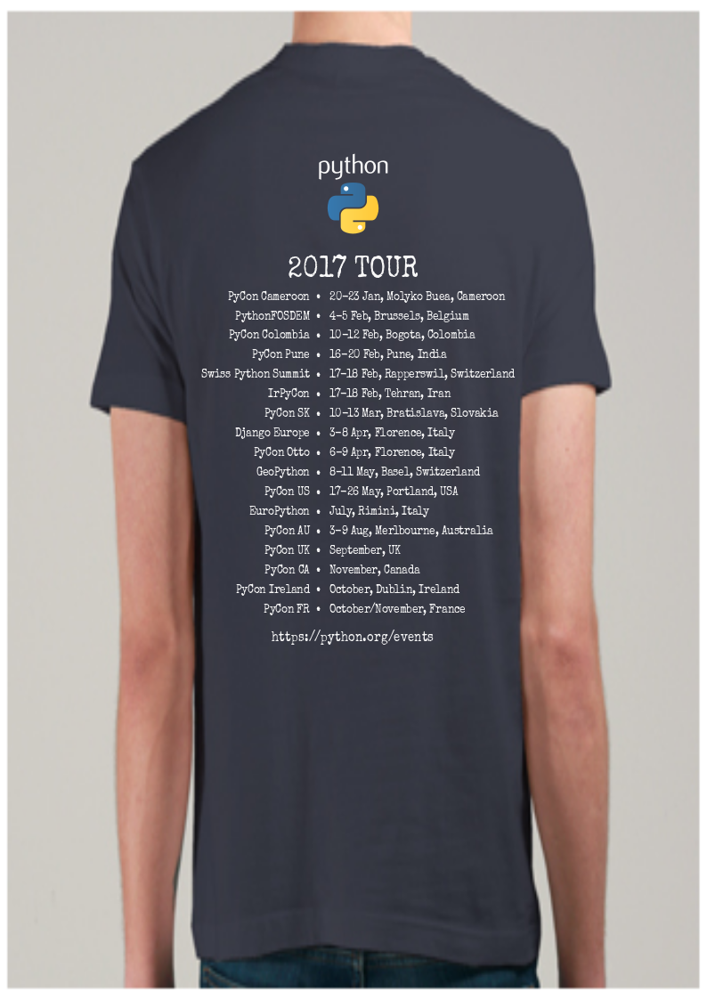

# Events in 2017

Hello, for the PythonFOSDEM [1] on 4th and 5th February in Belgium, I would like to present some slides with the Python events around the World. Based on https://python.org/events, I have noted that there are missing events, for example:

* PyCon Otto: Italy
* PyCon UK: United Kingdom
* PyCon CA: Canada
* PyCon Ireland: Ireland
* PyCon France: France

Some of these events are not yet announced and I understand they are in the second semester, and thus, they don't know the location and the dates, excepted for PyCon Otto (April).

In fact, I have noted that we know some big events in the Python community (for example: PyCon US and EuroPython) but do you know the others events, maybe the local event, PyCon IE, PyCon UK or PyCon IT.

I like to know where there is a PyCon or a Django Conf or a PyData Event.

In fact, I think we can help the Python Community if we submit all the events in https://python.org/events.

This page has been created by the PSF and is maintained by some volunteers.

I am also working on a t-shirt for the Python events in 2017

I know this list of events: 

* PyCon Cameroon : 20-23 Jav, Cameroon
* PythonFOSDEM : 4-5 Feb, Belgium
* PyCon Colombia : 10-12 Feb, Colombia
* PyCon Pune : 16-20 Feb, India
* Swiss Python Summit : 17-18 Feb, Switzerland
* IrPyCon : 17-18 Feb, Iran
* PyCon SK : 10-13 Mar, Slovakia
* Django Europe : 3-8 Apr, Italy
* PyCon Otto : 6-9 Apr, Italy
* Python Sudeste : 5-7 Mai, Brazil
* GeoPython : 8-11 May, Switzerland
* PyCon US : 17-26 May, USA
* EuroPython : July, Italy
* PyCon AU : 3-9 Aug, Australia
* PyCon UK : September, United Kingdom
* PyCon CA : November, Canada
* PyCon Ireland : October, Ireland
* PyCon FR : October/November, France

And you ? 

Please, could you check on https://www.python.org/events/ 

If you think there is a missing event, please, send me the info via [email](mailto:stephane@wirtel.be) or via my [twitter account](https://twitter.com/matrixise) and I will add it on my slides.

Thank you so much for your help.

Stephane

[1] https://www.python-fosdem.org