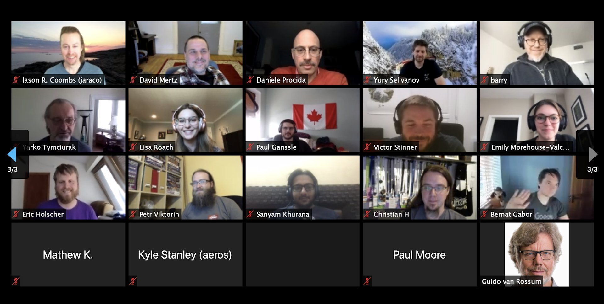
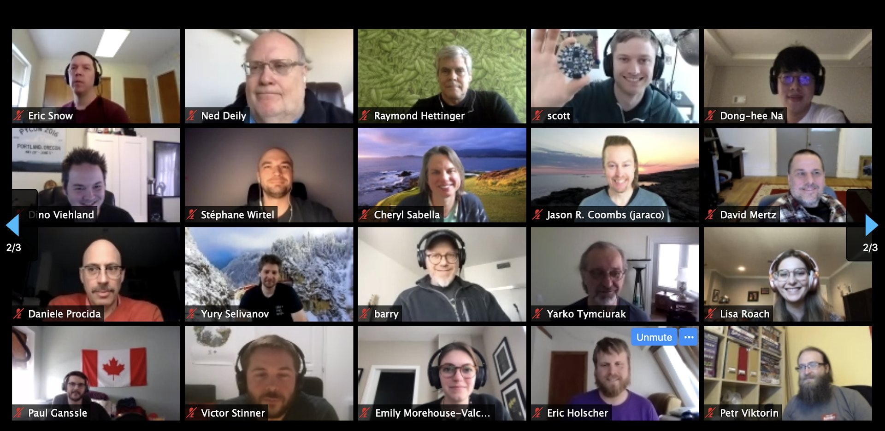
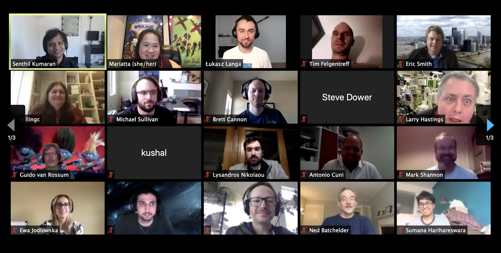

# Weekly Update 

## Work

* Move to my office for online meetings
* Create a new micro-service with FastAPI
* Experiment Elassandra (ElasticSearch and Cassandra)
* Play with VueJS and Vuetify
* Onboarding of a new colleague

## Python and the community

### PyCon
* I was supposed to be in Pittsburgh for [PyCon US 2020](https://www.pycon.us)
* on Wednesday and Thursday, there was the first online [Python Language Summit](https://us.pycon.org/2020/events/languagesummit/), organized by Mariatta and Łukasz:
  * Zoom (conference), Sli.do (Q&A session)
  * ~ 50 attendees
  * Talks:
    * *All strings become f-string* by **Eric V. Smith**
    * *Replacing CPython's parser with a PEG-based parser* by **Pablo Galindo**, **Lysandros Niolaou**, **Guido van Rossum**
    * *A formal specification for the (C)Python virtual machine* by **Mark Shannon**
    * *HPy: a future-proof way of extending Python* by **Antonio Cuni**
    * *CPython Documentation: The Next 5 years* by **Carol Willing**, **Ned Batchelder**
    * *The path forward for typing* by **Guido van Rossum**
    * *Property-Based Testing for Python builtins and the standard library* by **Zac Hatfield-Dodds**
    * *Core Workflow updates* by **Mariatta**
    * *CPython on Mobile platforms* by **Russell Keith-Magee**

#### Pictures

### EuroPython
* EuroPython Society Board meeting: Big discussion about Zoom and Discord, we will use these platforms for EuroPython 2020.
* The talk voting is Open, you can start to vote for your favourite talks (https://blog.europython.eu/post/615363800716263424/europython-2020-talk-voting-is-open)

* Work with the Program WG
    * Prepare emails
    * Cancel the duplicated talks for EP2020

Cheers,

Stéphane