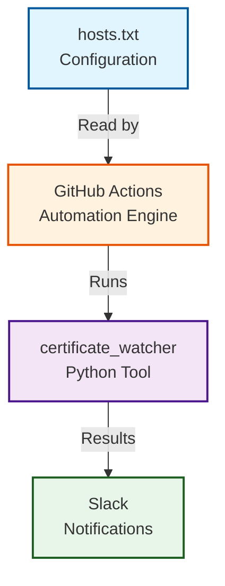

## Introduction

As a consultant constantly working with clients, I found myself in a familiar predicament: my head was always down, focused on delivering value to customers, but my own infrastructure monitoring was non-existent. I had no simple way to track SSL/TLS certificate expirations across the multiple domains I managed - personal sites, client projects, and community services.

I needed a solution, but I had several constraints:

1. **No time for complex setup**: I couldn't afford to spend days installing, configuring, and deploying yet another monitoring service
2. **Easy maintenance**: Whatever I built had to be low-maintenance - I didn't want another system to babysit
3. **Transparency and control**: I wanted a simple text file in Git listing the hosts to monitor, so I could see exactly what was being checked and track changes over time
4. **Zero infrastructure**: No servers to provision, patch, or pay for

Around this time, a friend named Julien shared his project called `certificate_watcher`, a lightweight Python tool for checking SSL certificate expiration. I contributed a few patches (if memory serves), and it clicked: what if I could combine this with GitHub Actions and Slack notifications?

The result was elegant: a GitHub Action that runs weekly, checks all my certificates using `certificate_watcher`, and sends the results directly to Slack. Zero infrastructure, minimal maintenance, and complete visibility into my certificate health.

In this article, I'll walk you through how I built this system and how you can adapt it for your own infrastructure. Whether you manage a handful of domains or dozens of endpoints, this serverless approach can be set up in under an hour.

## The Problem

For my own sites, I use Let's Encrypt - it's a wonderful solution for deploying web applications with SSL certificates without spending money on commercial CAs. However, the early days of Let's Encrypt, before the ACME protocol matured, were painful. You had to stop your web server, place a verification file in a specific location, restart the service... it was tedious and error-prone.

What inevitably happened was that some sites weren't monitored properly (lack of time, forgetfulness, you name it), and their SSL certificates expired. I'd have to SSH into the server and repeat the entire renewal procedure. It was, frankly, a mess.

Later, as the ACME protocol improved and DNS-based validation became available, the process became much simpler. But even with automated renewals, I still needed a basic monitoring system. Why? Because using this simple monitoring tool made me realize that while Let's Encrypt is brilliant, it also introduces maintenance overhead that needs to be tracked.

As our infrastructure grew across multiple projects - personal websites, business applications, and community services - so did the number of TLS certificates to manage. Each domain requires regular renewal, typically every 90 days with Let's Encrypt or annually with traditional certificate authorities.

Manual certificate tracking quickly becomes unsustainable:
- **Human error**: It's easy to forget which certificates expire when
- **Distributed ownership**: Different team members manage different services
- **No visibility**: Without monitoring, you only discover expired certificates when users report outages
- **Time-consuming**: Manually checking certificate expiration dates across dozens of domains is tedious

We needed a solution that would:
1. Automatically check all our certificates on a regular schedule
2. Alert the team proactively before expiration
3. Require minimal maintenance and zero infrastructure
4. Be free or extremely low-cost

## The Solution: Architecture Overview

The solution consists of three simple components working together:



One aspect I particularly love about this approach is the **GitOps philosophy**: using a Git repository to manage infrastructure configuration. With a simple text file (`hosts.txt`) versioned in Git, I can easily verify what's being monitored through code review and version control - much more reliable than logging into a web service to check settings. The file might change slightly as I add or remove hosts, but the workflow remains constant and predictable.

**Why GitHub Actions?**
- Free for public repositories (2,000 minutes/month for private repos)
- No servers to maintain or monitor
- Built-in scheduling with cron syntax
- Secure secrets management
- Easy integration with notification services

**Why certificate_watcher?**

The tool was created by [Julien Palard](https://mdk.fr/), a friend and Python core developer with whom I've had the pleasure of collaborating. I contributed modestly to the project, and it perfectly fit my needs:

- Lightweight Python package available on [PyPI](https://pypi.org/project/certificate-watcher/)
- Simple command-line interface
- Reads host lists from files
- Provides clear, actionable output
- No complex configuration required

This approach is entirely serverless - there's no infrastructure to provision, patch, or maintain. The entire monitoring system lives as code in a Git repository.

## Implementation Details

### 4.1 Setting Up the Host List

Since `certificate_watcher` expects a simple text file, we give it exactly that - no complex configuration formats needed. The foundation is a simple text file (`hosts.txt`) listing all domains and endpoints to monitor:

```
# Wirtel.be
www.wirtel.be
wirtel.be

# Mgx.io
www.mgx.io
mgx.io
odoo.mgx.io:443
odoo-legacy.mgx.io:443

# PythonFOSDEM
www.python-fosdem.org
python-fosdem.org
```

**Key features:**
- **Simple format**: One host per line
- **Custom ports**: Use `domain:port` syntax for non-standard ports (default is 443)
- **Organization**: Comments (lines starting with `#`) help group related domains
- **Version controlled**: Track changes to your monitored hosts over time

This declarative approach makes it easy to add or remove hosts - just edit the file and commit.

### 4.2 The GitHub Actions Workflow

The heart of the automation is a GitHub Actions workflow (`.github/workflows/certificate_watcher.yml`). Note that this setup dates back to May 2021, so you'll see older action versions (`@v3` instead of `@v4`) - they still work perfectly, but feel free to update to newer versions if you prefer:

```yaml
name: Check Certificates
on:
  schedule:
    - cron: '0 0 * * 0'  # Every Sunday at midnight UTC
  workflow_dispatch:      # Allow manual triggers

jobs:
  check-certificates:
    name: Check TLS Certificates
    runs-on: ubuntu-latest

    steps:
      - uses: actions/checkout@v3

      - name: Set up Python 3.10
        uses: actions/setup-python@v3
        with:
          python-version: "3.10"

      - name: Install certificate_watcher
        run: |
          python -m pip install --upgrade pip
          python -m pip install -r requirements.txt

      - name: Execute certificate_watcher
        id: certificate_watcher_step
        run: |
          echo "::set-output name=watcher_output::$(certificate_watcher -f hosts.txt)\n"

      - name: Notify Slack
        uses: rtCamp/action-slack-notify@v2
        env:
          SLACK_WEBHOOK: ${{ secrets.SLACK_WEBHOOK }}
          SLACK_TITLE: Check TLS Certificates
          SLACK_MESSAGE: ${{ join(steps.certificate_watcher_step.outputs.*, '\n')}}
```

**Workflow breakdown:**

1. **Trigger mechanisms:**
   - `schedule`: Runs automatically every Sunday at midnight UTC via cron
   - `workflow_dispatch`: Enables manual execution from the GitHub Actions UI

2. **Environment setup:**
   - Uses Ubuntu latest runner (free tier)
   - Sets up Python 3.10 (works perfectly for this use case, though you can use newer versions)
   - Installs dependencies from `requirements.txt`

3. **Certificate checking:**
   - Executes `certificate_watcher -f hosts.txt`
   - Captures output for notification step

4. **Result delivery:**
   - Uses rtCamp's Slack notification action
   - Sends results to configured Slack webhook

### 4.3 Slack Integration

The Slack integration uses the popular [rtCamp/action-slack-notify](https://github.com/rtCamp/action-slack-notify) GitHub Action, which simplifies webhook-based notifications.

**Setup steps:**

1. Create a Slack webhook:
   - Go to https://api.slack.com/apps
   - Create a new app or use existing
   - Enable "Incoming Webhooks"
   - Create webhook for your desired channel
   - Copy the webhook URL

2. Add webhook to GitHub Secrets:
   - Navigate to repository Settings → Secrets and variables → Actions
   - Create new secret named `SLACK_WEBHOOK`
   - Paste your webhook URL

3. Configure notification format:
   - `SLACK_TITLE`: Header for the message
   - `SLACK_MESSAGE`: Content from certificate_watcher output

The result is clean, formatted notifications delivered directly to your team's Slack channel whenever the workflow runs.

## How It Works: End-to-End Flow

Let's walk through what happens when the workflow executes:

**1. Scheduled trigger (Sunday midnight)**
GitHub Actions automatically starts the workflow based on the cron schedule.

**2. Environment preparation**
- Spins up a fresh Ubuntu virtual machine
- Checks out the repository code
- Installs Python 3.10 and pip

**3. Dependency installation**
Installs `certificate_watcher` (version 0.0.5 from our pinned requirements.txt):
```bash
pip install -r requirements.txt
```

**4. Certificate verification**
Executes the monitoring tool:
```bash
certificate_watcher -f hosts.txt
```

For each host, `certificate_watcher`:
- Resolves the domain name
- Establishes TLS connection on the specified port (default 443)
- Retrieves the SSL/TLS certificate
- Extracts expiration date and validity information
- Checks for common issues (expired, self-signed, hostname mismatch)
- Formats results in human-readable output

**5. Output capture**
The workflow captures the complete output, which includes:
- Certificate expiration dates for each domain
- Days until expiration
- Any warnings or errors
- Summary statistics

**6. Slack notification**
Sends formatted results to the configured Slack channel. Team members see:
- Which certificates are healthy
- Which certificates are approaching expiration
- Any immediate issues requiring attention

**7. Cleanup**
GitHub Actions automatically tears down the virtual machine - no resources left running.

The entire process completes in under 2 minutes, using minimal compute resources from the free tier.

## Maintenance & Best Practices

### Testing Locally

Before committing changes to `hosts.txt`, test locally:

```bash
# Install certificate_watcher
pip install -r requirements.txt

# Run the checker
certificate_watcher -f hosts.txt
```

This validates:
- Host file syntax is correct
- Domains are resolvable
- Certificates are accessible
- You'll see the same output the workflow will produce

### Adding or Removing Hosts

To modify monitored domains:

1. Edit `hosts.txt`
2. Add new domains (one per line)
3. Use `domain:port` for non-standard ports
4. Organize with comments for clarity
5. Test locally
6. Commit and push

The next scheduled run (or manual trigger) will include your changes.

### Adjusting Notification Frequency

The weekly schedule (`'0 0 * * 0'`) balances awareness with notification fatigue. You can adjust the cron expression:

- **Daily**: `'0 0 * * *'`
- **Bi-weekly**: `'0 0 * * 0/2'`
- **Monthly**: `'0 0 1 * *'`
- **Custom**: Use [crontab.guru](https://crontab.guru) to design your schedule

## Benefits & Results

After implementing this solution, I've experienced several tangible benefits:

**Zero infrastructure costs**
- Runs entirely on GitHub Actions free tier
- No servers, databases, or monitoring services to pay for
- Scales effortlessly as we add more domains

**Minimal maintenance overhead**
- No security patches or server maintenance
- **GitOps approach**: Configuration lives in version control, which I absolutely love - every change is tracked, auditable, and can be rolled back if needed

**Proactive issue detection**
- Weekly checks are brilliant - `certificate_watcher` verifies expiration dates and we're immediately informed when a certificate is approaching its end-of-life, giving us plenty of time to renew
- Team visibility via Slack ensures someone sees every alert
- No more surprise certificate expirations

**Team transparency**
- Everyone sees the same notifications
- Clear accountability for certificate renewal
- Historical record in Slack channel

**Simple onboarding**
- New team members understand the system by reading the workflow file
- Adding domains is as simple as editing a text file
- No specialized knowledge required

## Possible Enhancements

While the current solution works well, here are some enhancements to consider. Keep in mind that the beauty of this system is its simplicity - `certificate_watcher` does DNS resolution, connects to servers via sockets, reads certificates, and checks expiration dates and validity (including detecting self-signed certificates). Sometimes simple is better than feature-rich.

**Multiple notification channels**
- Add email notifications for redundancy
- Integrate with PagerDuty for on-call alerting
- Send to multiple Slack channels based on domain groups

**Custom expiration thresholds**
- Alert at different intervals (90, 30, 7 days before expiration)
- Escalate notifications as expiration approaches
- Different thresholds for critical vs non-critical services

**Historical tracking**
- Store results in GitHub Issues or Gists
- Track certificate renewal patterns
- Generate reports on certificate health over time

**Dashboard integration**
- Create a status page showing all certificates
- Visual indicators for certificate health
- Public or internal dashboard

**Multi-environment support**
- Separate host lists for staging, production, etc.
- Different notification channels per environment
- Environment-specific scheduling

That said, for monitoring a handful of TLS certificates, is it really worth over-engineering? Sometimes the simplest solution that works is the best solution.

## Conclusion

Building a robust certificate monitoring system doesn't require expensive tools or complex infrastructure. By combining GitHub Actions' free automation capabilities with the simple `certificate_watcher` utility, we created a solution that:

- Monitors all our TLS certificates automatically
- Alerts the team proactively before issues occur
- Costs nothing to operate
- Requires almost no maintenance
- Lives as code in version control

The entire implementation took less than an hour and has been running reliably for months. If you manage multiple domains and want peace of mind about certificate expirations, I encourage you to adapt this approach for your own infrastructure.

The complete code for this monitoring system is available in this repository. Feel free to fork it, adapt it to your needs, and suggest improvements. Here's to never experiencing another surprise certificate expiration!

A big thank you to [Julien Palard](https://mdk.fr/) for creating `certificate_watcher` and for being an amazing colleague and friend! It's been far too long since we last talked - I tend to be a bit of a hermit in my cave, sometimes forgetting to hop on IRC or send an email to check in on friends. I hope we can reconnect soon, Julien!

---

**Resources:**
- certificate_watcher on PyPI: https://pypi.org/project/certificate-watcher/
- GitHub Actions documentation: https://docs.github.com/en/actions
- rtCamp Slack Notify Action: https://github.com/rtCamp/action-slack-notify
- Cron expression editor: https://crontab.guru